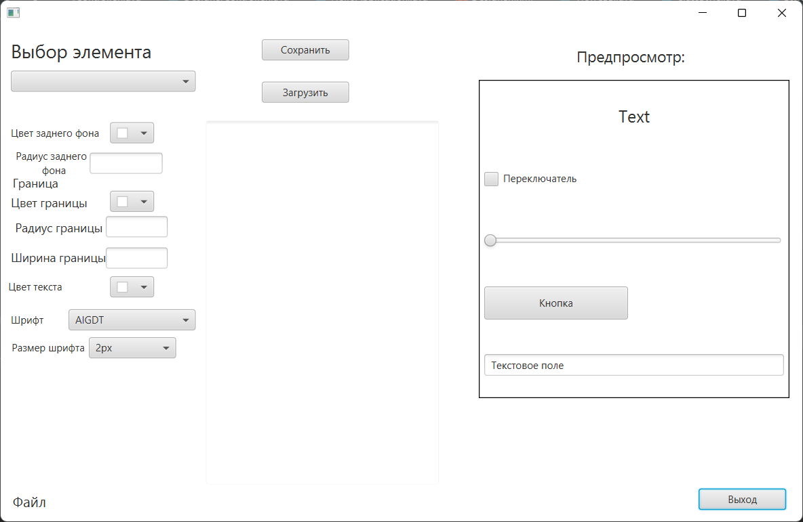

# EditorCSS
## Описание
## Здесь была Никитина Екатерина Романовна

Программный продукт предназначен для построения и отображения плана сети.
- **Технологический стек:** Java, javafx.
- [Проект](https://github.com/katyabarkalova/EditorCSS/releases/download/v1.0/EditorCSS.zip)
- **Статус**: 1.1

Скриншот рабочего окна приложения: 

## Зависимости
Язык разработки Java. Для создания пользовательского интерфейса используется платформа JavaFX. Для упрощения организации и работы с интерфейсом в JavaFX может использоваться язык разметки FXML, который создан на основе XML. FXML позволяет определить интерфейс приложения декларативным способом подобно тому, как веб-страницы определяются с помощью HTML.

JavaFX предоставляет мощные инструменты для разработки современных графических интерфейсов и поддерживает множество функций, таких как анимация, 3D-рендеринг и интеграция с медиа. Использование FXML в комбинации с JavaFX значительно упрощает процесс создания интерфейса, позволяя разработчикам отделять логику приложения от его визуального оформления.

## Установка
- Скачать проект
- Распаковать архив
### Требования к предварительной установке
- Windows, Linux or MacOS
- Archiver (winrar, 7-Zip, etc)
- Installed JDK 17

## Приглашение к сотрудничеству
Загрузите исходные тексты или клонируйте их с помощью команды git clone в выбранный каталог: git clone [https://github.com/katyabarkalova/EditorCSS.git](https://github.com/katyabarkalova/EditorCSS.git) и создайте ветку

## Остальные ссылки
[LICENSE](LICENSE)

